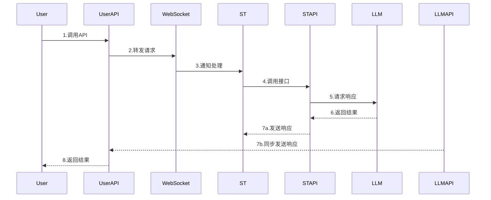

# SillyTavern Extension - ChatBridge 

一个用于SillyTavern的API桥接扩展，让外部应用能够复用SillyTavern的对话功能，像调用api一样在SillyTavern中聊天。

An API bridging extension for SillyTavern that allows external applications to reuse SillyTavern's conversation functionality, enabling chat in SillyTavern as if calling an API.

## 简介 / Introduction
> *我很高兴地宣布我写完了此项目的主要功能，这是最新的更新，和之前的版本完全不同了，重构了基本功能并且实现了向外部开设Openai格式的api，适用于任何openai应用程序调用SillyTavern的强大功能。*

> *I'm pleased to announce that I have completed the main features of this project. This is the latest update, completely different from previous versions. I've restructured the basic functionality and implemented an OpenAI-format API for external use, suitable for any OpenAI application to leverage SillyTavern's powerful capabilities.*

本项目是一个SillyTavern扩展，通过WebSocket和API转发的方式，实现了将SillyTavern作为中间件服务的功能。它包含以下组件：

This project is a SillyTavern extension that turns SillyTavern into a middleware service through WebSocket and API forwarding. It consists of the following components:

- SillyTavern UI Extension: 负责与WebSocket服务器通信
- ChatBridge_APIHijackForwarder.py: 核心服务器组件，提供WebSocket和API接口
- 配置文件：用于设置各类连接参数

- SillyTavern UI Extension: Responsible for communication with the WebSocket server
- ChatBridge_APIHijackForwarder.py: Core server component, providing WebSocket and API interfaces
- Configuration files: Used to set various connection parameters

该扩展可以让任何支持OpenAI API格式的外部应用通过SillyTavern的对话管理系统与LLM进行交互。

This extension allows any external application that supports the OpenAI API format to interact with LLMs through SillyTavern's conversation management system.

## 使用说明 / Usage Instructions

### 1. 安装扩展 / Install the Extension

1. 复制项目文件到SillyTavern扩展目录:
   Copy the project files to the SillyTavern extension directory:
```bash
/public/scripts/extensions/third-party/SillyTavern-Extension-ChatBridge/
```

### 2. 启动服务 / Start the Service

0. 你可能需要配置settings.json文件中的各api的base_url和apikey。

   You may need to configure the base_url and apikey for various APIs in the settings.json file.

1. 启动Python服务器:
   Start the Python server:
```bash
python ChatBridge_APIHijackForwarder.py
```

2. 在SillyTavern扩展设置中配置并连接WebSocket:
   Configure and connect to WebSocket in SillyTavern extension settings:
- 设置服务器地址(默认localhost)
- 设置端口(默认8001)
- 点击"连接"按钮

- Set the server address (default: localhost)
- Set the port (default: 8001)
- Click the "Connect" button

### 3. 外部应用调用 / External Application Calls

配置外部应用的API设置， 如:
Configure the API settings for external applications, for example:
```python
client = OpenAI(
    api_key="your-user-api-key",
    base_url="http://localhost:8003/v1"
)
```

## 内部逻辑 / Internal Logic

请求流程:
Request flow:
1. 外部应用 → 用户API(8003) → WebSocket(8001)
2. WebSocket → SillyTavern UI Extension
3. SillyTavern处理 → ST API(8002)
4. ST API → LLM API → 获取响应
5. 响应同时返回给ST和用户API

1. External App → User API(8003) → WebSocket(8001)
2. WebSocket → SillyTavern UI Extension
3. SillyTavern processing → ST API(8002)
4. ST API → LLM API → Get response
5. Response returned to both ST and User API



### 重要说明 / Important Notes

- 需要SillyTavern最新版本支持`context.clearChat()`和`context.printMessages()`
- 所有API采用OpenAI格式
- 支持流式和非流式响应， **但必须保证ST的设置和应用程序的设置都保持流式/非流式一致**
- 支持多个LLM API密钥轮询

- Requires the latest version of SillyTavern with support for `context.clearChat()` and `context.printMessages()`
- All APIs use OpenAI format
- Supports both streaming and non-streaming responses, **but ensure that ST settings and application settings are consistent for streaming/non-streaming**
- Supports multiple LLM API keys rotation

## 依赖要求 / Dependencies

- Python 3.7+
- SillyTavern最新版本 / Latest version of SillyTavern
- aiohttp
- websockets

## 许可证 / License

本项目采用AGPL-3.0许可证
This project is licensed under AGPL-3.0

## 已知问题

- 若对UserApi的请求在上一条信息响应未完全结束时，发送另一条请求，有大概率会得到相同的回复。即转发器设计bug使得UserApi对短时间的请求将会给出相同的复制的响应，将在未来的版本修复，此Bug不影响单机串行使用。